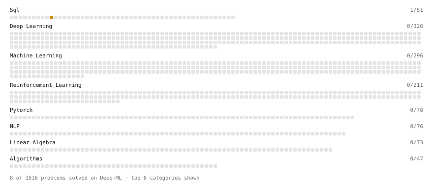

# Deep-ML

My machine learning practice from [Deep-ML](https://www.deep-ml.com). Every solution here was written by hand.

**3** solved · 3 problems · 0 labs · 0 math

[**Browse the interactive portfolio**](https://AbhaySoam123.github.io/deep-ml/) to replay this filling in over time.

## Problems

| | Difficulty | Solved | |
| --- | --- | --- | --- |
| [Handle Missing Data in pandas (dropna/fillna)](https://www.deep-ml.com/problems/1128) | easy | 2026-10-04 | [solution](problems/1128-handle-missing-data-in-pandas-dropna-fillna) |
| [Filter, Group, and Aggregate a DataFrame (Top-10 by Metric)](https://www.deep-ml.com/problems/1127) | medium | 2026-10-04 | [solution](problems/1127-filter-group-and-aggregate-a-dataframe-top-10-by-metric) |
| [Merge Multiple DataFrames](https://www.deep-ml.com/problems/1129) | medium | 2026-10-04 | [solution](problems/1129-merge-multiple-dataframes) |

---

_This file is regenerated by Deep-ML on every push._
